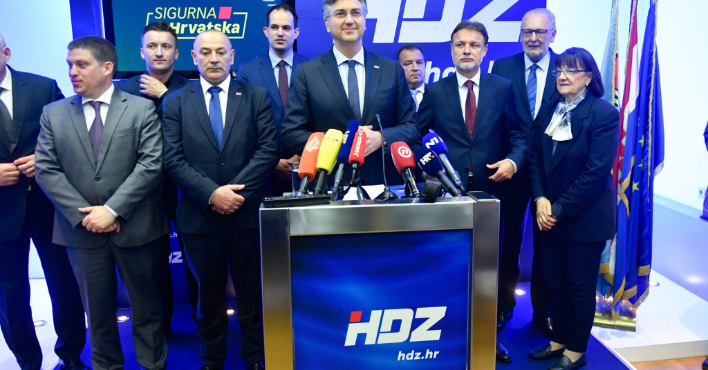

 
 

# Social-media-and-politics
Analiza HDZ na društvenim medijima.

  

 
 

## Pregled

Specificirani ciljevi:
 
-	Koliko često korisnici digitalnih platformi Facebook i Twitter spominju Hrvatsku demokratsku zajednicu u svojim objavama na Facebooku i Twitteru
 
-	kolika je raspršenost pojedinaca (profila) koji iznose svoja mišljenja i stavove o Hrvatskoj demokratskoj zajednici (objavljuju li uvijek isti profili objave o HDZ-u)
 
- Postoje li čvorišta iz kojih kreće u prosjeku relativno veći broj objava o  Hrvatskoj demokratskoj  zajednici te definirati doseg objava iz čvorišta
 
-	Udio objava o Hrvatskoj demokratskoj zajednici koji su izvorni sadržaj i udio objava koji su nastali kao dijeljenje već postojećeg sadržaja (share i retweet)  
 
-	Aatributi koji najčešće spominju u objavama u kojima se spominje Hrvatska demokratska zajednica te prepoznati sentiment (pozitivno, negativno, neutralno) tih atributa
 
-	Osobe, institucije i poduzeća koja najčešće spominju u objavama u kojima se spominje Hrvatska demokratska zajednica
 
-	Povezanost spominjanja pojedinih atributa međusobno te autora objave i pojedinog atributa koji se spominje u objavi
 
-	Razlike i promjene kroz vrijeme
 
Uzorak:
Sve javno dostupne objave na digitalnih platformama Facebook i Twitter u razdoblju od 18. travnja do 3. svibnja 2021. godine. koje u sebi sadrže pojam HDZ.
 
Populacija: 
Sve objave na digitalnim platformama Facebook  i Twitter objavljene u razdoblju od 18. travnja do 3. svibnja 2021. godine. koje u sebi sadrže pojam HDZ.

Rezultati na [poveznici](https://raw.githack.com/lusiki/Social-media-and-politics/main/Scripts/HDZanaliza.html).
